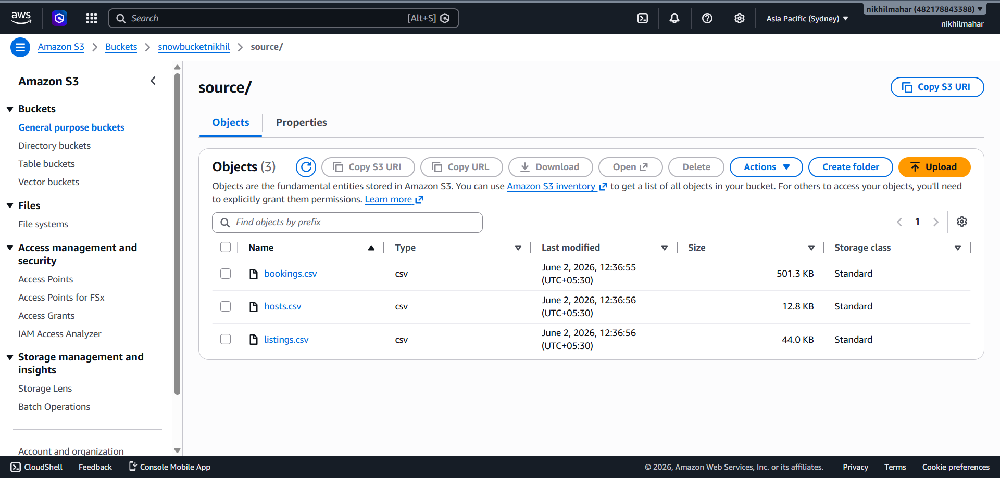
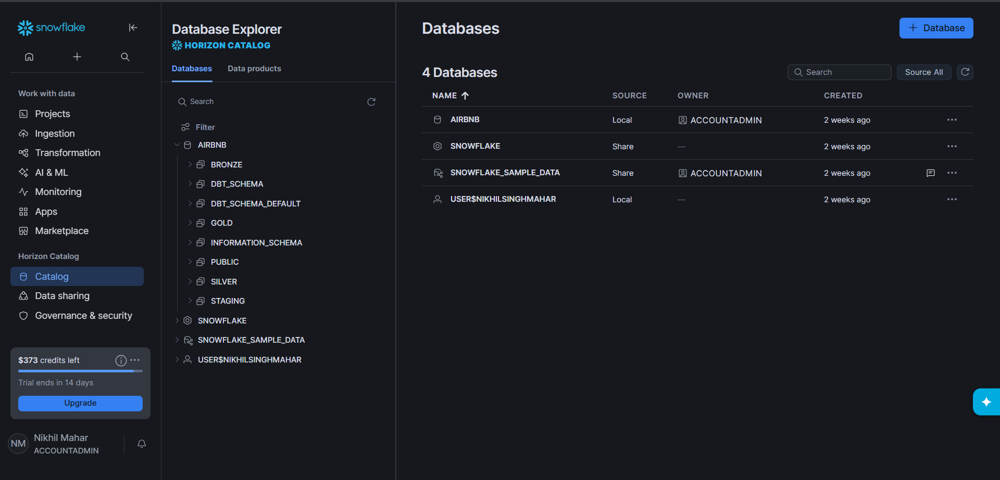
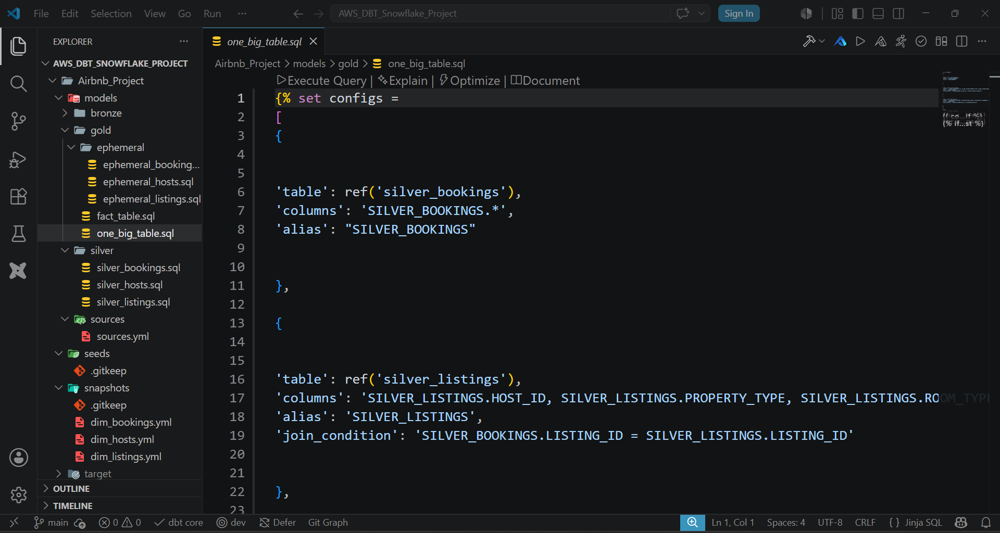

## Overview

This project demonstrates an end-to-end Airbnb analytics workflow using AWS S3, Snowflake, dbt, and Git. The pipeline follows the Medallion Architecture (Bronze → Silver → Gold) to transform raw Airbnb data into trusted, analytics-ready datasets.

The objective is to build a scalable, secure, and maintainable data platform that supports business reporting, analytics, and decision-making.

---

## Project Architecture

Source Data → AWS S3 → Snowflake → dbt Models (Bronze → Silver → Gold) → Analytics Ready Dataset

### Technologies Used

- AWS S3
- AWS IAM
- Snowflake
- dbt (Data Build Tool)
- SQL
- Git & GitHub
- Medallion Architecture
- Data Quality Testing
- Snapshots

---

## Business Problem

Organizations often receive raw operational data that contains:

- Duplicate records
- Missing values
- Inconsistent formatting
- Poor data quality
- No historical tracking
- Difficult-to-maintain SQL transformations

These issues create unreliable reporting and inaccurate business insights.

This project solves these challenges by implementing a structured analytics engineering workflow using dbt and Snowflake.

---

## Solution

The solution ingests Airbnb datasets into Snowflake through AWS S3 and transforms the data using dbt.

The project implements:

- Layered Medallion Architecture
- Data Quality Validation
- Snapshot-based Change Tracking
- Reusable dbt Macros
- Automated Testing
- Version Control with Git
- Modular SQL Transformations

This creates trusted and analytics-ready datasets that can be consumed by BI tools and reporting systems.

---

# Medallion Architecture

## Bronze Layer

The Bronze layer stores raw source data loaded from Snowflake external sources.

Responsibilities:

- Preserve raw data
- Initial ingestion
- Minimal transformations
- Maintain source fidelity

Examples:

- bronze_bookings
- bronze_hosts
- bronze_listings

---

## Silver Layer

The Silver layer cleans and standardizes data.

Responsibilities:

- Remove duplicates
- Standardize formats
- Data cleansing
- Business rule implementation
- Improved data quality

Examples:

- silver_bookings
- silver_hosts
- silver_listings

---

## Gold Layer

The Gold layer contains analytics-ready datasets optimized for reporting and business intelligence.

Responsibilities:

- Business metrics
- Fact tables
- Dimension tables
- Aggregated reporting datasets
- Analytical consumption

Examples:

- Fact Table
- One Big Table
- Analytical Reporting Models

---

## Data Quality & Validation

Data quality is enforced using dbt tests.

Implemented validations include:

### Unique Key Validation

Ensures business identifiers remain unique.

Examples:

- listing_id
- host_id
- booking_id

### Not Null Validation

Prevents critical business fields from containing null values.

### Custom Tests

Additional business rule validations implemented using SQL-based tests.

### Generic Tests

Reusable generic tests were created to improve scalability and maintainability.

---

## Snapshots

dbt Snapshots are implemented to track historical changes in Airbnb entities.

Benefits:

- Historical tracking
- Slowly Changing Dimensions (SCD)
- Auditing
- Change monitoring

Snapshot examples:

- dim_bookings
- dim_hosts
- dim_listings

---

## Macros

Reusable dbt macros were created to reduce repetitive SQL logic.

Benefits:

- Reusability
- Maintainability
- Standardized transformations
- Faster development

Examples:

- Discount calculations
- Multiplication functions
- Dynamic schema generation
- Reusable business logic

---

## Security

Security was implemented using AWS IAM.

### AWS IAM

Used for:

- Access control
- Secure authentication
- Resource authorization
- Principle of least privilege

### Snowflake Security

- Role-based access control
- Warehouse management
- Schema-level permissions

---

## Version Control

Git and GitHub were used for:

- Source control
- Collaboration
- Change tracking
- Project documentation
- Deployment management

---

## Project Structure

```text
Airbnb_Project/

├── models/
│   ├── bronze/
│   ├── silver/
│   └── gold/
│
├── snapshots/
│
├── tests/
│
├── macros/
│
├── seeds/
│
├── sources/
│
└── dbt_project.yml
```

---

## Key Features

- End-to-End Analytics Engineering Workflow
- AWS S3 Data Lake Storage
- Snowflake Cloud Data Warehouse
- dbt Transformation Framework
- Medallion Architecture
- Automated Data Testing
- Snapshot Management
- Reusable Macros
- Data Quality Enforcement
- Version Controlled Development

---

## Potential Business Use Cases

This architecture can support:

- Revenue Analytics
- Property Performance Analysis
- Host Performance Tracking
- Booking Trend Analysis
- Occupancy Reporting
- Customer Behavior Analysis
- Business Intelligence Dashboards
- Executive Reporting

---

# Screenshots

## AWS Architecture



---

## Snowflake Catalog Structure



---

## dbt Models



---

## Learning Outcomes

Through this project, I gained hands-on experience with:

- Analytics Engineering
- Data Modeling
- Medallion Architecture
- Snowflake Data Warehousing
- AWS S3 Integration
- IAM Security
- dbt Development
- Data Quality Testing
- Snapshot Management
- Git & GitHub Workflow
- Modular SQL Development

---

## Author

**Nikhil Singh Mahar**

Analytics Engineering | Data Engineering | dbt | Snowflake | AWS | SQL
